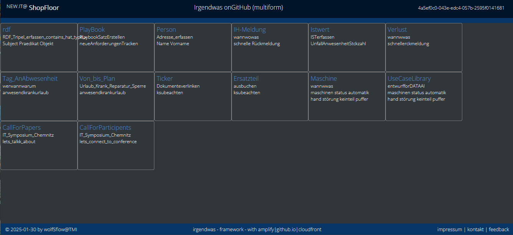

# idsearch.github.io

Using Git Pages for static Web-Sites

**Siehe auch**
|.|.|
|-|-|
Quelle|*...\_D\my_apps\gitvwidsearch\idsearch.github.io*

## Version
|Datum|Version|WER|Beschreibung|
|-|-|-|-|
|2025-01-21|0.1|stw|Dokument strukturiert |
||||


## Inhalt
|Top|Funktionalität|Beschreibung|
|-|-|-|
|1|[Task 1](#irgendwas)|Irgendwas
||||

## Irgendwas
[zum Inhalt](#inhalt)

Eine Muster-Tabelle


Werte als JSON

```json
[{ "_id"   : "id1"
 , "KST"   : "K1"
 , "DAT"   : "2024-03-07"
 , "BEZ"   : "Bezeichnung1"
 , "WERT"  : 1
 , "SPARK" : "0.1,0.5,0.3,0.4,0.6,0.2,0.4,0.2,1.0,0.2,0.4,0.8"
 }
]
```
### Verändern von Spaltenfunktionalität

|Symbol|Bezeichnung|Beispiel
|-|-|-|
|WF|Workflow| . . . X . .
|BF|Bits in Bytes| . X . X X
|LF|Balken| X X X . . .
|BC|BarCode| ##..##..#.#.
|HF2|Sparkline 12| + + - - + +
|HF3|Spark Period vs previous Period|
|||

## Multiform

ein Weg, um lose gekoppelte asynchrone SDysteme zu realisieren.

